# ToDoListアプリ
RaiseTech 22年05月度 最終課題Spring Boot RestAPIのCRUDアプリ

---
## 概要
ToDoの登録ができるCRUDアプリです。（2022.9.1完成）  
READ・CREATE・UPDATE・DELETE機能を実装しています。  
単体テスト、結合テスト、Github ActionsでのCIも実装しています。

---
## 構成要件
* Java 17
* Spring Boot 2.7.2
* JUnit 5.8.2
* MySQL 8.0.28
* Docker 20.10.17
* JUnit 5
* Mockito

---
## 機能一覧
* タスク全件取得
* 特定のタスクを１件取得
* タスクの新規登録
* タスクの編集
* 未完了⇄完了の切替
* 削除

---

## DBテーブル
テーブル名：to_do_list  

| カラム名 | データ型 | NotNull | 備考 |
| ------------ | ------------- | ------------- | ------------- | 
| id | BIGINT | NOT NULL | ID、主キー |
| is_done | BOOLEAN | NOT NULL | TRUE:完了／FALSE:未完了、DEFAULT FALSE |
| task | VARCHAR(256)  | NOT NULL | タスク内容 |
| limit_date | DATE |  | 期限 |

---

## URL設計
| No | 画面名／機能名     | method | URL          | 
|-------------|-------------| ------------ |-----------------| 
| 1 | タスク一覧取得     | GET | /todos      |
| 2 | 特定のタスクを１件取得 | GET | /todos/{id} |
| 3 | タスクの新規登録 | POST | /todos |
| 4 | タスクの編集 | PATCH | /todos/{id} |
| 5 | タスクの削除 | DELETE | /todos/{id} |

---

## ResponseBody

<h4> 1. GET /todos </h4>

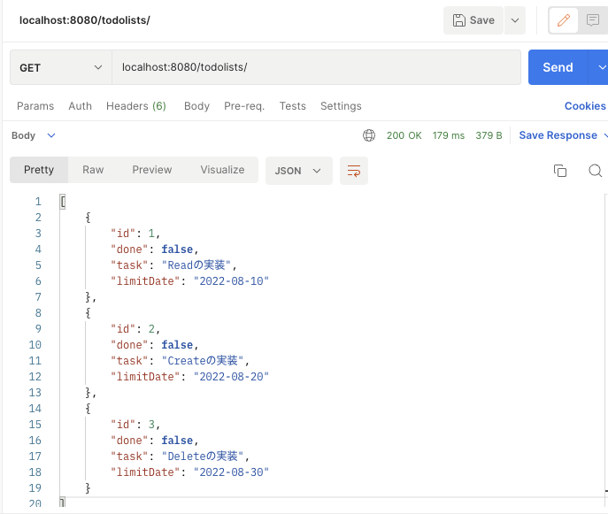

<h4> 2-1. GET /todos/{id} </h4>

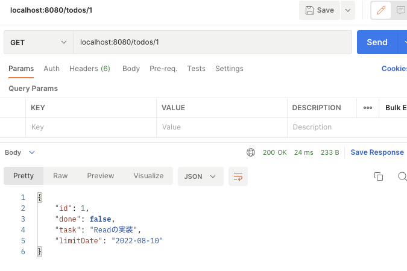

<h4> 2-2. GET /todos/{id}で存在しないタスクIDを指定した時 </h4>

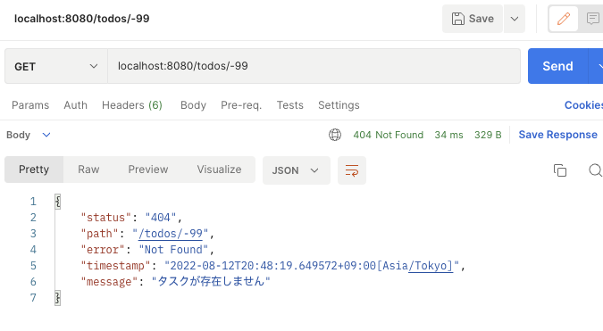

<h4> 3-1. POST /todos </h4>

<h5>ResponseBody</h5>

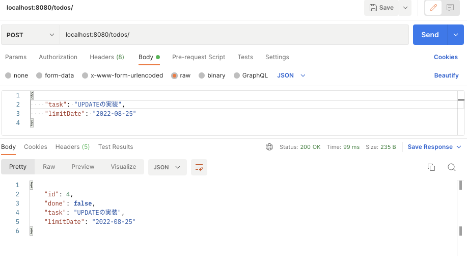
<h5>ResponseHeaders</h5>

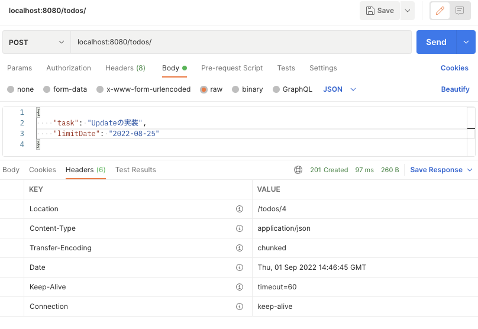

<h4> 3-2. POST /todosでnullをPOSTした時 </h4>

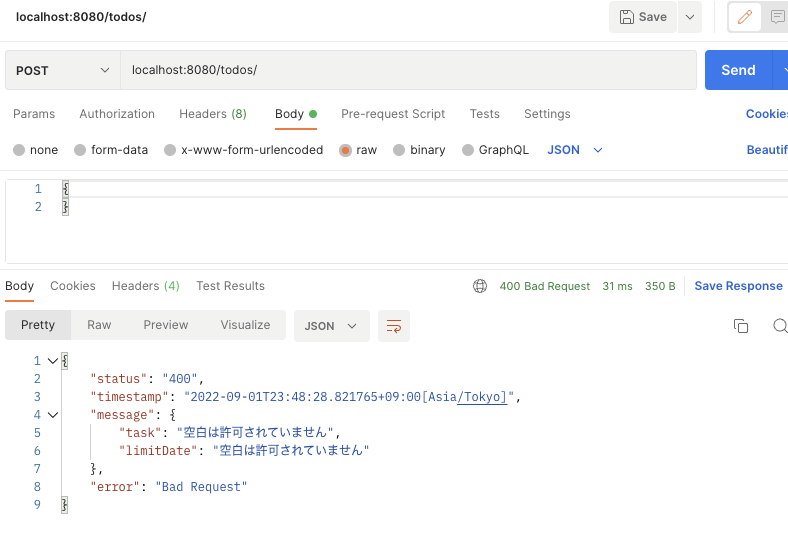

<h4> 3-3. POST /todosでtaskに256文字以上POSTした時 </h4>

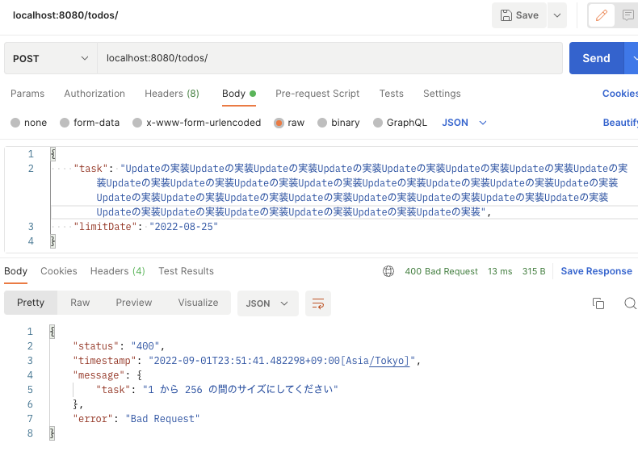

<h4> 3-4. POST /todosでlimitDateにyyyy-MM-dd以外の型をPOSTした時 </h4>

<h4> 4-1. PATCH /todos/{id} </h4>

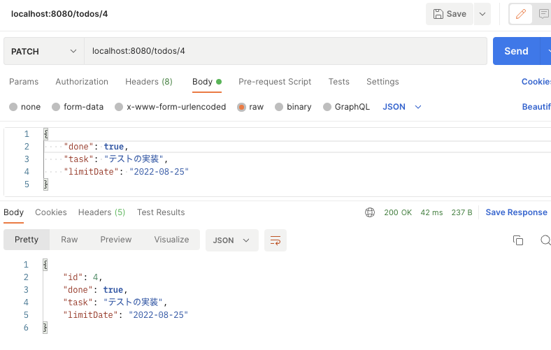
<h5>変更したいものだけ変えられます。</h5>

<h4> 4-2. PATCH /todos/{id}で存在しないタスクIDを指定した時 </h4>

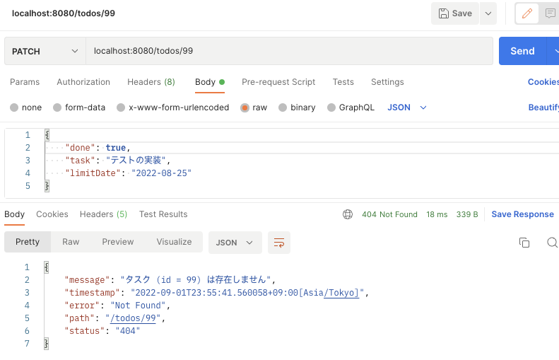

<h4> 4-3. PATCH /todos/{id}でnullをPATCHした時 </h4>

<h5>変化しません。</h5>

<h4> 4-4. PATCH /todos/{id}でlimitDateにyyyy-MM-dd以外の型をPATCHした時 </h4>

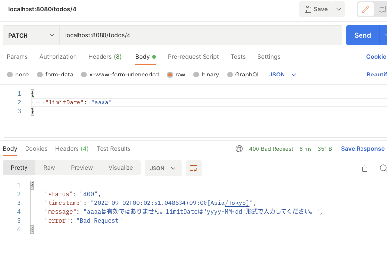

<h4> 5-1. DELETE /todos/{id} </h4>

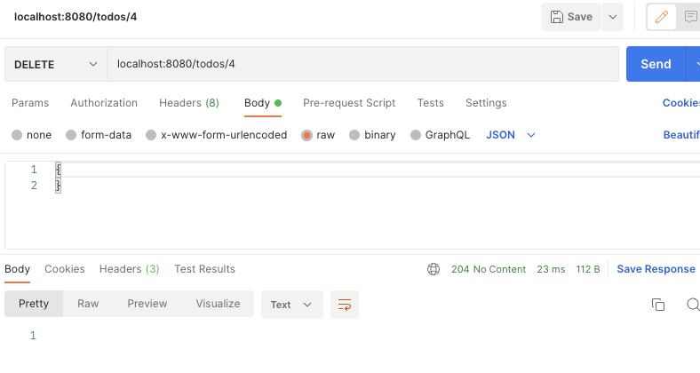

<h4> 5-2. DELETE /todos/{id}で存在しないタスクIDを指定した時 </h4>

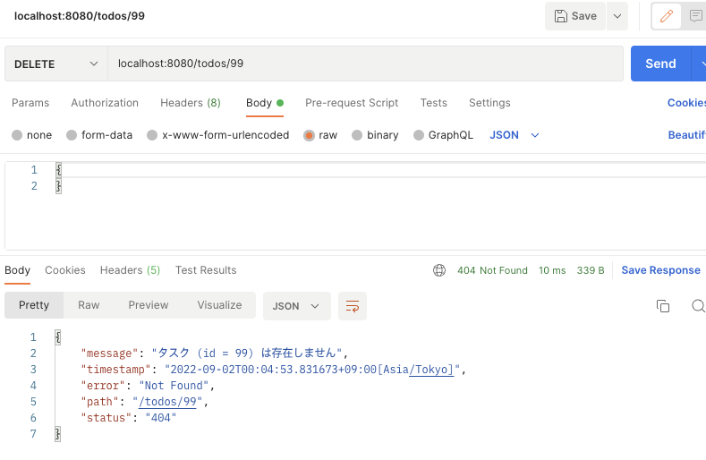

