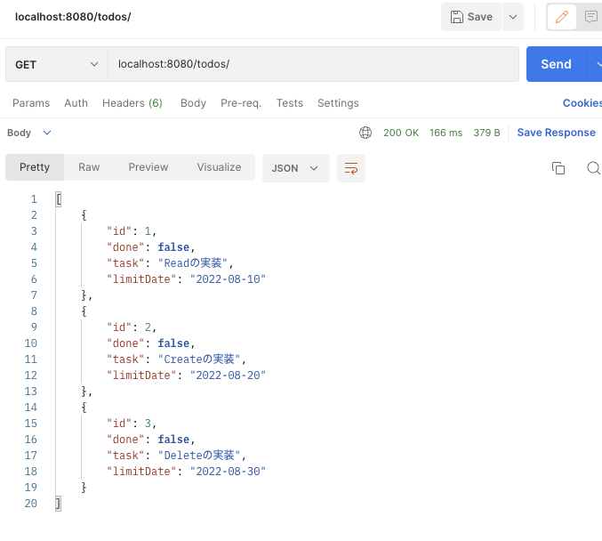

# ToDoListアプリ
RaiseTech 22年05月度 最終課題Spring Boot RestAPIのCRUDアプリ

---
## 概要
ToDoの登録ができるCRUDアプリになる予定です。 
2022.8.12時点ではREAD機能のみです。
---
## 構成要件
* Java 17
* Spring Boot 2.7.2
* JUnit 5.8.2
* MySQL 8.0.28
* Docker 20.10.17

---
## 機能一覧
* タスク全件取得
* 特定のタスクを１件取得
<!-- 
* 新規登録
* 編集
* 削除
* 未完了⇄完了の切替
-->
---

## DBテーブル
テーブル名：to_do_list  

| カラム名 | データ型 | NotNull | 備考 |
| ------------ | ------------- | ------------- | ------------- | 
| id | BIGINT | NOT NULL | ID、主キー |
| id_done | TINYINT(1) | NOT NULL | TRUE:完了／FALSE:未完了、DEFAULT FALSE |
| task | VARCHAR(256)  | NOT NULL | タスク内容 |
| limit_date | DATE |  | 期限 |

---

## URL設計
| 画面名／機能名     | method | URL          | 
|-------------| ------------ |-----------------| 
| タスク一覧取得     | GET | /todolists      |
| 特定のタスクを１件取得 | GET | /todolists/{id} |

1. GET /todolists

2. GET /todolists/{id}

3. GET /todolists/{id}で存在しないタスクを指定した時の例外処理

---

## テスト一覧
- **ToDoRepositoryTest クラス**
  - すべてのタスク情報が取得できること
  - IDを指定して特定のタスク情報が取得できること
- **ToDoServiceTest クラス**
  - タスク全件を正常に返すこと
  - 存在するタスクのIDを指定したときに正常にタスクが返されること
  - 存在しないタスクのIDを指定したときに正常に例外が投げられていること
- **UserRestApiIntegrationTest クラス**
  - タスクを全件取得できること
  - 特定のタスクを１件取得できること
